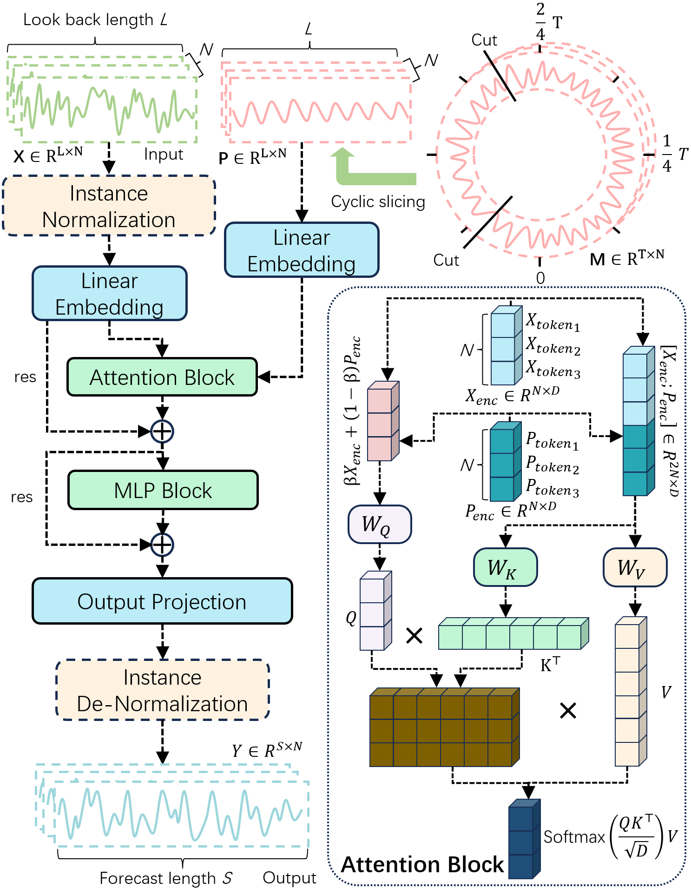

# DCNet: Multivariate Time Series Forecasting via an Efficient Dual Context Network

> **Official Implementation** of the paper: *"DCNet: Multivariate Time Series Forecasting via an Efficient Dual Context Network"*

## 📋 Overview

**DCNet** is a novel Transformer-based architecture for multivariate time series forecasting (MTSF). It introduces the **Global and Local Dual Context (DC)** technique to achieve deep synergistic modeling between:
- **Global Periodic Context (GPC)**: Stable periodic patterns as reference benchmarks
- **Local Evolutionary Context (LEC)**: Residual components and instantaneous observation data

Unlike previous methods that isolate these two contexts, DCNet enables local dynamics to perceive their real-time temporal position within the global cycle, effectively eliminating "perceptual blind spots" and filtering out spurious correlations in high-noise environments.

### Key Features

- 🏆 **State-of-the-art performance** on 12 real-world benchmark datasets
- 🔄 **Cross-architecture portability**: DC technique works on both Transformer and linear models
- ⚡ **High efficiency**: Optimal balance between accuracy and computational cost
- 🎯 **Robustness**: Stable performance across different random initializations

---

## 🏗️ Architecture

<div align="center">

<p><b>Figure 1:</b> Overview of the DCNet framework. Left: model operation flowchart. Right: DC-enhanced attention mechanism design.</p>
</div>

### Core Components

1. **DC-enhanced Attention Mechanism**
   - Reconstructs the retrieval space by concatenating LEC and GPC representations
   - Query: Weighted fusion of local and global contexts
   - Key/Value: Extended composite context
   - Expands token scale from N to 2N while maintaining N  D output dimension

2. **SwiGLU-based MLP**
   - Replaces traditional FFN with dual-branch interaction mechanism

3. **Inverted Embedding Paradigm**
   - Maps the full sequence of each variable into a token (following iTransformer)
   - Enables explicit modeling of inter-variable correlations


---

## 🚀 Quick Start

## Environment Setup

You can set up the environment using either of the following two methods:

### Method A: Clone the Conda Environment (Recommended for exact reproduction)
This will create a new environment named `DCNet` with all exact dependencies.

```bash
# Create environment from the provided .yml file
conda env create -f environment.yml

# Activate the environment
conda activate DCNet
```

### Method B: Manual Installation via Pip
If you prefer to use your existing environment or are on a different OS:

```bash
# Create a fresh environment (optional)
conda create -n DCNet python=3.8
conda activate DCNet

# Install dependencies
pip install -r requirements.txt
```

### Requirements File

```
einops==0.8.1
joblib==1.4.2
scikit-learn==1.3.2
scipy==1.10.1
thop==0.1.1-2209072238
threadpoolctl==3.5.0
torchaudio==2.4.0
torchvision==0.19.0
```

---

## 📁 Project Structure

```
DCNet/
├── data_provider/          # Data loading and preprocessing
│   ├── data_loader.py
│   └── data_factory.py
├── experiments/            # Experiment configurations and logs
├── layers/                 # Core model components
├── model/                  # Model architectures
│   ├── DCNet.py       # Main GLDCformer model
│   └── DCDLinear.py      # GLDC-enhanced linear models
├── scripts/                # Training scripts
│   ├── Ablation/           # Ablation study scripts
│   └── DCNet/         # Main experiment scripts
│       ├── electricity.sh
│       ├── etth1.sh
│       ├── etth2.sh
│       ├── ettm1.sh
│       ├── ettm2.sh
│       ├── pems03.sh
│       ├── pems04.sh
│       ├── pems07.sh
│       ├── pems08.sh
│       ├── solar.sh
│       ├── traffic.sh
│       └── weather.sh
├── utils/                  # Utility functions
├── environment.yml
├── requirement.txt
├── run.py                  # Main entry point
└── README.md
```

---

## 🎯 Running Experiments

### 1. Long-term Forecasting (Main Results)

All experiments use fixed look-back window $L=96$ and prediction lengths $S \in \{96, 192, 336, 720\}$ (for non-PEMS datasets) or $S \in \{12, 24, 48, 96\}$ (for PEMS datasets).


```bash
# ETTh1
bash scripts/DCNet/etth1.sh

# ETTh2
bash scripts/DCNet/etth2.sh

# ETTm1
bash scripts/DCNet/ettm1.sh

# ETTm2
bash scripts/DCNet/ettm2.sh

# PEMS03
bash scripts/DCNet/pems03.sh

# PEMS04
bash scripts/DCNet/pems04.sh

# PEMS07
bash scripts/DCNet/pems07.sh

# PEMS08
bash scripts/DCNet/pems08.sh

# Solar
bash scripts/DCNet/solar.sh

# Weather
bash scripts/DCNet/weather.sh

# Traffic
bash scripts/DCNet/traffic.sh
```

### 2. Ablation Studies

```bash
# Run all ablation experiments
bash scripts/Ablation/All_Electricity.sh
bash scripts/Ablation/All_PEMS03.sh
bash scripts/Ablation/All_PEMS04.sh
bash scripts/Ablation/All_PEMS07.sh
bash scripts/Ablation/All_PEMS08.sh
bash scripts/Ablation/CycleNet_Electricity.sh
bash scripts/Ablation/CycleNet_PEMS03.sh
bash scripts/Ablation/CycleNet_PEMS04.sh
bash scripts/Ablation/CycleNet_PEMS07.sh
bash scripts/Ablation/CycleNet_PEMS08.sh
bash scripts/Ablation/DLinear_Electricity.sh
bash scripts/Ablation/DLinear_PEMS03.sh
bash scripts/Ablation/DLinear_PEMS04.sh
bash scripts/Ablation/DLinear_PEMS07.sh
bash scripts/Ablation/DLinear_PEMS08.sh
bash scripts/Ablation/FFN_Electricity.sh
bash scripts/Ablation/FFN_PEMS03.sh
bash scripts/Ablation/FFN_PEMS04.sh
bash scripts/Ablation/FFN_PEMS07.sh
bash scripts/Ablation/FFN_PEMS08.sh
bash scripts/Ablation/DC_Electricity.sh
bash scripts/Ablation/DC_PEMS03.sh
bash scripts/Ablation/DC_PEMS04.sh
bash scripts/Ablation/DC_PEMS07.sh
bash scripts/Ablation/DC_PEMS08.sh
```
